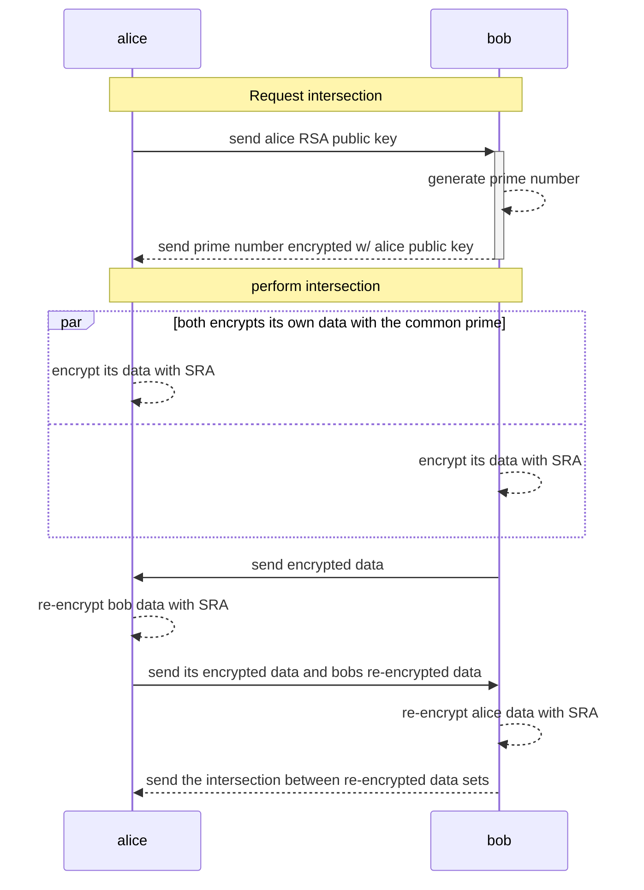

# GoPSI - Private Set Intersection in Golang

Simple Private Set Intersection implemented in pure Go. It uses SRA algorithm [[1]](#references) as encryption scheme and Bloom Filters [[2]](#references) to perform set intersection.

## Basic usage protocol

The following diagram explains the basic example of the library using [Client](./pkg/client/client.go) (alice) and [Server](./pkg/server/server.go) (bob) structs. This example is implemented into [psi_example/main.go](./examples/psi_example/main.go) file.

However you can use [SRA](./pkg/sra/sra.go) or [BloomFilters](./pkg/bloomfilter/bloomfilter.go) isolated and also design your own protocol using it.

## Docs & example
Checkout [GoDoc Documentation](https://godoc.org/github.com/lucasmenendez/gopsi)

## References

1. Adi Shamir, Ronald L. Rivest and Leonard M. Adleman, *"Mental Poker"*, April 1979. https://people.csail.mit.edu/rivest/pubs/SRA81.pdf
2. Wikipedia, *"Bloom filter"*, July 2005. https://en.wikipedia.org/wiki/Bloom_filter