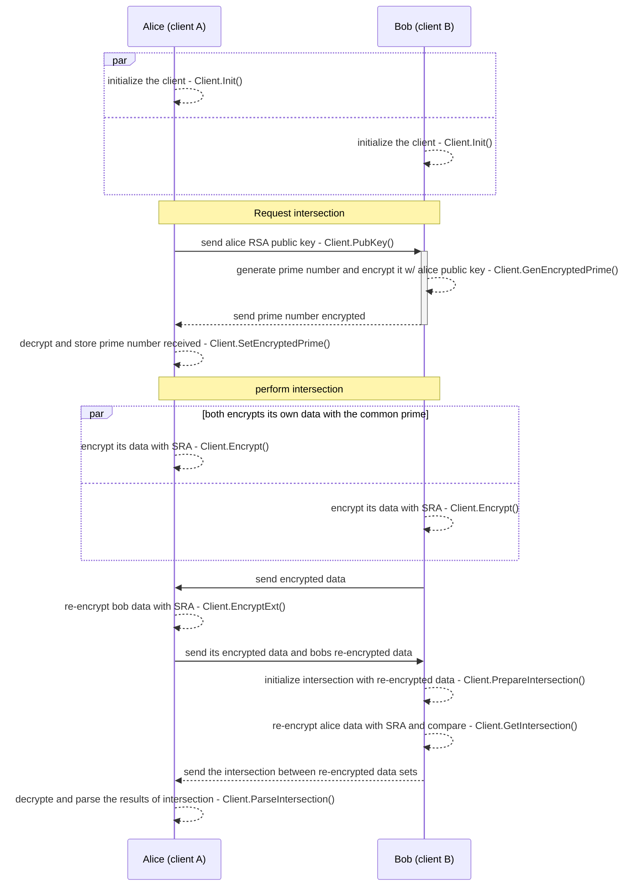

# Basic PSI protocol example

The following diagram explains the basic example of the library using [Client](/pkg/client/client.go) to implement **two roles that want to know the common items between they data without share the raw version with the other**:

**_Alice (client A)_**:
 1. Shares to Bob him RSA public key to share the common prime number securily.
 2. With him SRA key, encrypts him own data, receives the Bob encrypted data and re-encrypts it to be shared with Bob.
 3. Receives the interesection result and parse it (decrypting with him SRA key).

**_Bob (client B)_**:
 1. Generates a common prime and encrypt it with the Alice RSA public key to share it with her.
 2. With his SRA key, encrypts his own data, send it to Alice to be re-encrypted by she.
 3. Receives his re-encrypted data from Alice and creates a Bloom Filter to be rady for any intersection request.
 4. Receives Alice encrypted data to perform the intersection, re-encrypts it with his SRA key and compare with his 
 5. re-encrypted data using the Bloom Filter.
 
 This example is implemented into [psi_example/main.go](./main.go) file.

However you can use [SRA](/pkg/sra/sra.go) or [BloomFilters](/pkg/bloomfilter/bloomfilter.go) isolated and also design your own protocol using it.

## Run the example

```sh
go run main.go
```

## Iteration flow

