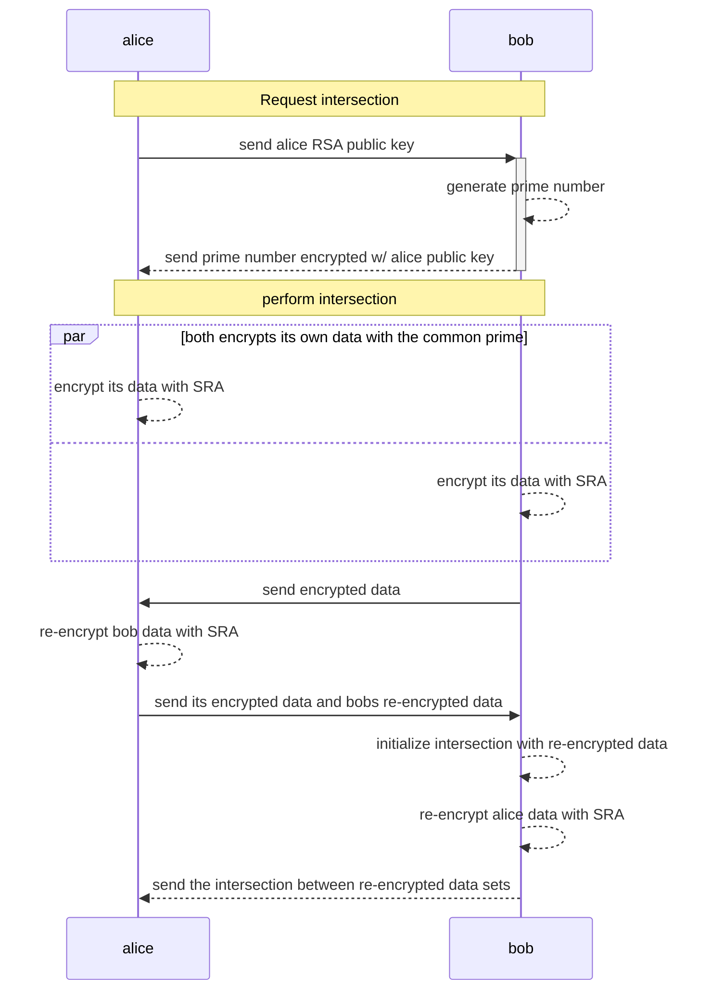

# Basic PSI protocol example

The following diagram explains the basic example of the library using [Client](/pkg/client/client.go) (alice) and [Server](./pkg/server/server.go) (bob) structs. This example is implemented into [psi_example/main.go](./main.go.go) file.

However you can use [SRA](/pkg/sra/sra.go) or [BloomFilters](/pkg/bloomfilter/bloomfilter.go) isolated and also design your own protocol using it.

## Iteration flow



## Run example

```sh
go run main.go
```